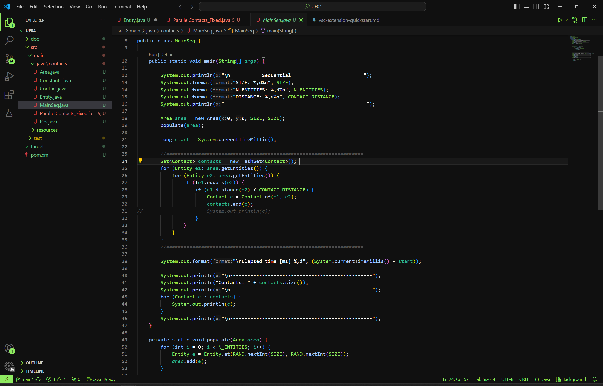

# About
This is a theme I made for myself based on my mascot, a green cat. It's very dark, code is high contrast and comments
blend in with the background more so that they don't get in the way. To me this makes the code more readable and the structure more defined at a glance.

Maybe you'll like it too :)

Here's the cat

In Java it will look something like this:

